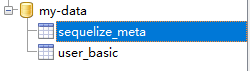
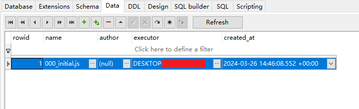
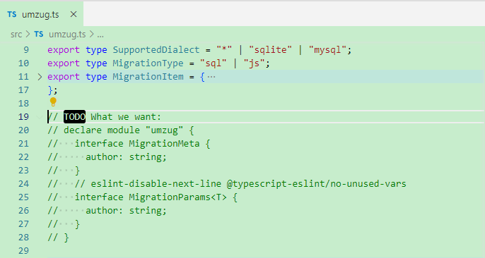
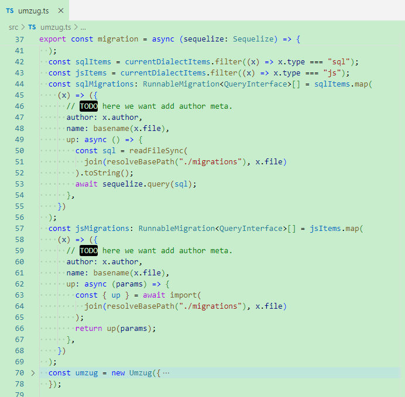
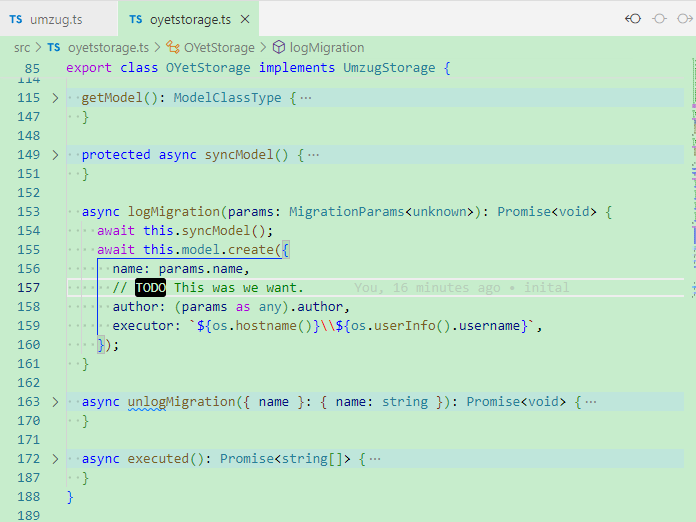

# For umzug report

## Step1
```bash
$ npm i
$ npm run start
```

## Step2
look the database result.

We see the tables was created  


and the `sequelize_meta` data was:  


there is no `author` column.

## What we want

1. User can override types  


2. User can use self defined properties with types  


3. The properties can taken effected.  
